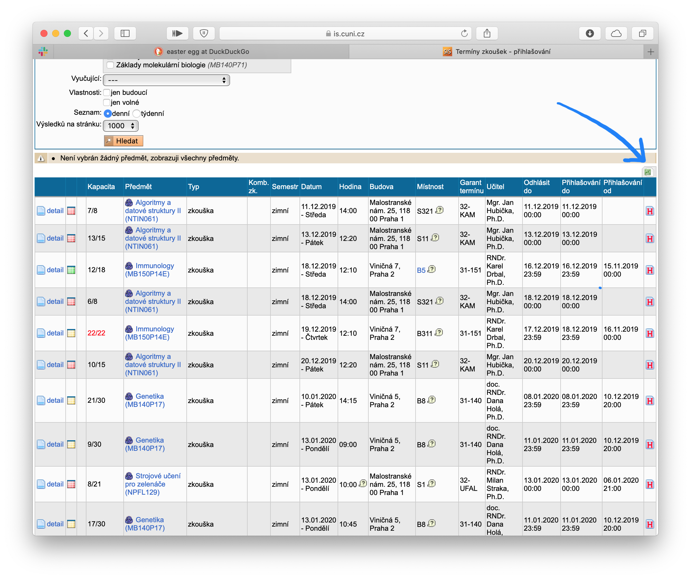
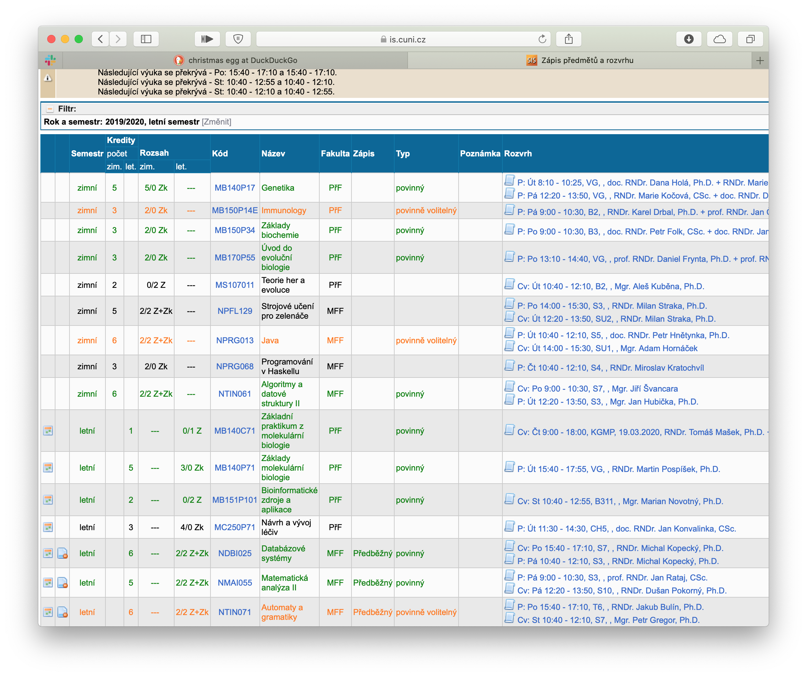

# Planex

Planex je program na rozvrhování zkoušek (*ex*am *plan*ner) pro jakoukoli univerzitu používající SIS. Stačí mu zadat seznam zkoušek a stránku s informacemi o předmětech (obojí stažené ze SISu) a on vám zkoušky rozplánuje tak, abyste na každou měli tak akorát času.

K přizpůsobení Planexu se používá jednoduchý konfigurační soubor (jeho dokumentace viz [zvláštní soubor](config-doc.md)). Můžete tak například specifikovat, kolik chcete u jakého předmětu nechat náhradních termínů, nebo že na konci zkouškového se místo na zkoušky chystáte skočit na lanovku v Alpách.

## První spuštění

Pokud nemáte konfigurační soubor (což se při prvním použití předpokládá), nevadí — stačí Planex prostě spustit a nechat se interaktivním průvodcem provést vytvořením konfigurace. Průvodce pracuje na několika úrovních, které se liší tím, na jak velké podrobnosti se vás během konfigurace ptá. Pro ideální  poměr mezi časem stráveným konfigurací a užitečností výsledků pro nové uživatele doporučejeme úroveň `1`.

Na všech úrovních je klíčové **zadání cest ke dvěma souborům**: excelové tabulce s termíny zkoušek a html souboru s informacemi o předmětech.

Tabulku s termíny zkoušek používá Planex (celkem předpokládatelně) k tomu, aby zjistil, z jakých předmětů vlastně děláte zkoušky a kdy se konají. Tabulku lze stáhnout, pokud jste přihlášení na SIS, v oddílu **Termíny zkoušek - přihlašování** > **Zapsat** a pak kliknutím na tlačítko s excelovskou ikonou, které se nachází nad pravým horním rohem tabulky s termíny.



Planex navíc nerozděluje čas na zkoušku předmětům naslepo, ale podle jejich *důležitosti*, kterou mimo jiné počítá z jejich kreditového ohodnocení a také z toho, jestli je předmět povinný/povinně volitelný nebo ne (více viz [Důležitost předmětu](#důležitost-předmětu)). 

Tyto informace je možné k předmětům vyplnit ručně, ale jednodušší je stáhnout ze SISu stránku, která tyto informace už obsahuje:  **Zápis předmětů a rozvrhu** > **Zapsané** a poté uložte celou stránku jako `.html` (to se nejčastěji dělá pomocí <kbd>Ctrl + S</kbd> nebo <kbd>Command + S</kbd>).



V úrovni `1` už je vlastně jen jedna věc, kterou je nutné ke každému předmětu vyplnit: kolik byste chtěli mít času na přípravu (to se bohužel nikde na SISu nepíše). Planex se bude snažit tyto časy dodržet — u důležitějších předmětů se bude snažit hodně — avšak naplnění ideální doby přípravy u všech předmětů zaručit nemůže.

## Druhé, třetí, čtvrté... spuštění

Při prvním použití jste si vytvořili a uložili konfigurační soubor, a Planex vám vrátil nějaké rovržení zkoušek — to vám ale možná úplně nevyhovuje. V takovém případě doporučujeme do konfiguračního souboru doplnit další detaily a spustit Planex znovu s touto novou konfigurací.

Abyste věděli, co a jak upravovat, je dobré přesně pochopit jak funguje výpočet důležitosti předmětu.

### Důležitost předmětu

Důležitost ovlivňuje, jak moc se Planex u daného předmětu snaží dodržet vámi zadaný ideální čas přípravy.

```
důležitost(p) = v * váha_p + k * kredity_p + s * st(status_p)
```

kde *v*, *k* a *s* jsou globální parametry udávající váhu jednotlivých vlastností předmětu a *st* je funkce přiřazující číslo různým statusům předmětu. *Kredity* a *status* jsou vlastnosti předmětu stažené ze SISu, zatímco *váha* je atribut, který každému předmětu přidělujete vy.

Úpravou těchto parametrů tedy můžete ovlivňovat, na co se Planex bude soustředit. Záleží vám hodně na Javě? Nastavte jí vysokou *váhu*. Chcete hlavně získat hodně kreditů? Nastavte vysoké *k*. Jsou pro vás nejdůležitějí volitelné předměty? Nastavte *st(volitelný)* na něco velkého.

Co znamená *nastavit x na něco vysokého* závisí na hodnotě ostatních parametrů; výchozí hodnoty lze vidět v interaktivním průvodci i v konfiguračním souboru.

### Úprava a načtení konfigurace

Konfigurační soubor má jednoduchý formát (viz [Dokumentace konfiguračního souboru](config-doc.md)), a jde tedy upravit ručně v jakémkoli textovém editoru. Je také možné jej upravit v interaktivním průvodci, což vám Planex sám nabídne jakmile mu zadáte existující konfigurační soubor — pokud chcete upravovat pokročilejší parametry důležitosti, zvolte úroveň podrobnosti `2` (popř. `3`).

Pokud Planex nenalezne uspokojující řešení ani s novou konfigurací, můžete zkusit ručně odstranit nějaký z předmětů tím, že mu v konfiguračním souboru přidáte vlastnost *ignorovat*. 

Planexu lze při spuštění z příkazové řádky jako argument zadat cestu k existujícímu konfiguračnímu souboru, popřípadě ji můžete zadat ihned po spuštění. 

## Princip funkce

Planex přeloží vaše požadavky do jazyka omezujích podmínek, které poté předá constraint programming (CP) modelu společně s ohodnocující *loss* funkcí, kterou se poté model bude snažit za daných podmínek minimalizovat. *loss* funkce v tomto konkrétním případě zhruba odpovídá rozdílu ideální a reálné doby přípravy na zkoušku.

Planex používá k hledání řešení knihovnu [Google OR-Tools](https://github.com/google/or-tools), konkrétně její CP-SAT část, která několikrát zvítězila na CP soutěžích, a která má zároveň přívětivou licenci Apache License 2.0 (viz složka `lib`).

